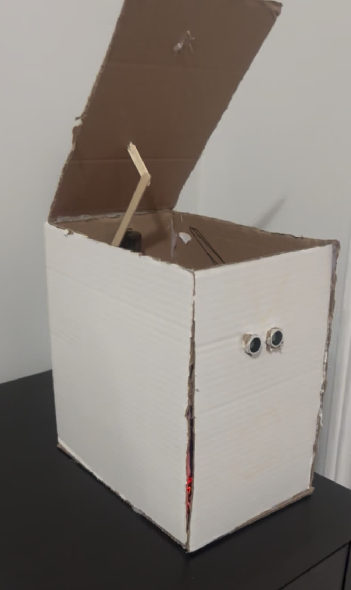

# Smart Trash Can

> A hands-free bin that opens when you walk up to it, because touching a trash can lid is objectively the
> worst part of throwing something out.

An ultrasonic sensor watches the space in front of the bin. Walk into range and a servo lifts the lid
through a reinforced popsicle-stick arm. Walk away and it closes on its own.



*Video: [`media/demo.mp4`](media/demo.mp4)*

---

## Why I built it

The goal was to make waste disposal more hygienic and just a little bit cooler than a normal trash bin.
It's a small idea, and that's exactly why it was a good first Arduino build — the mechanism is simple enough
that every problem I hit was a *real* problem rather than a complexity problem. Torque, linkage stiffness,
and sensor thresholds are the same three things that bite you on much bigger machines.

It's also the first piece of the smart house I keep saying I'm going to build. One appliance down.

## How it works

1. Ping the ultrasonic sensor, convert the echo time to centimetres.
2. Require **three consecutive readings** under the threshold before acting. Ultrasonic sensors throw
   occasional garbage values, and a single bad read used to make the lid twitch at nothing.
3. Sweep the servo open a couple of degrees at a time rather than snapping to the angle.
4. Keep the lid open while someone's still in range; close `HOLD_MS` after they leave.

## Hardware

| Part | Notes |
|---|---|
| Arduino Uno | |
| HC-SR04 ultrasonic sensor | mounted on the front face |
| SG90 / MG90S servo | MG90S if you can — see below |
| Popsicle sticks + hot glue | the lid arm, reinforced |
| Battery pack | separate from the Arduino's 5V |

Wiring is in [`docs/wiring.md`](docs/wiring.md).

## Build and flash

```bash
arduino-cli compile --fqbn arduino:avr:uno src/smart_trash_can
```

## What went wrong

**The first power setup didn't give the servo enough torque, so the lid barely moved.** This was the big
one. The lid has real weight and the servo was being run off a supply that sagged the moment it drew
current. Giving the servo its own supply fixed it — and sweeping the angle gradually instead of snapping
to it reduced the current spike further.

**A regular popsicle stick arm just bends under load.** Obvious in hindsight. Under the weight of the lid
the arm flexed instead of lifting, so the servo would rotate its full range and the lid would move about a
centimetre. Reinforcing it with extra glue and weight made the linkage rigid enough to actually transmit
the force.

**Fine-tuning the ultrasonic detection range.** Too short and you have to wave your hand like crazy. Too far
and it opens when you just walk past. `OPEN_CM` is the number that took the most back-and-forth, and it
depends on where the bin sits — mine is against a wall in a hallway, so a wide trigger radius was worse than
useless.

In the end I got a smooth, reliable open every time, and learned how small adjustments can make a big
difference to whether a project is actually usable.

## What I'd do differently

- **Use a proper linkage instead of a glued stick.** A rigid arm with a pivot would remove the flex entirely
  and let a smaller servo do the job.
- **Add a second sensor or a timeout on the open state**, so a bag leaning against the bin doesn't hold the
  lid open indefinitely.
- **Measure the current draw** instead of inferring the torque problem from behaviour. I diagnosed that one
  by watching the lid, which worked, but a multimeter would have taken five minutes instead of an evening.

## A note on this code

I built this bin and it works. The original sketch was lost, so this is a reconstruction of the working
build — same detection logic, same sweep behaviour, same reasons for each. The tuning constants are named
and grouped at the top because that's genuinely how I worked on it.

## License

MIT — see [LICENSE](LICENSE).
